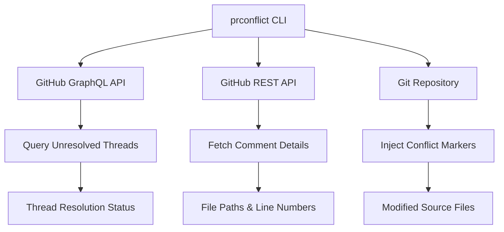

# prconflict

[](https://github.com/teddyknox/prconflict/actions/workflows/ci.yml)
[](https://goreportcard.com/report/github.com/teddyknox/prconflict)
[](https://opensource.org/licenses/MIT)
[](https://pkg.go.dev/github.com/teddyknox/prconflict)

> **GraphQL-powered tool that inserts unresolved PR review threads as Git conflict markers**

`prconflict` brings GitHub Pull Request review comments directly into your code editor by inserting unresolved review threads as Git-style conflict markers. This helps developers visualize and address PR feedback without constantly switching between their IDE and GitHub's web interface.

## 🚀 Features

- **Smart Filtering**: Only processes unresolved review threads using GitHub's GraphQL API
- **Conflict-Style Markers**: Inserts comments as familiar Git conflict blocks
- **Auto-Detection**: Automatically detects repository and PR number from your Git context
- **Chronological Ordering**: Preserves comment order within conversation threads
- **Cross-File Support**: Handles review comments across multiple files
- **Safe Operation**: Dry-run mode for previewing changes

## 📋 Table of Contents

- [Installation](#-installation)
- [Quick Start](#-quick-start)
- [Usage](#-usage)
- [Examples](#-examples)
- [Configuration](#-configuration)
- [Development](#-development)
- [Testing](#-testing)
- [Contributing](#-contributing)
- [License](#-license)

## 🛠 Installation

### Option 1: Download Binary (Recommended)

Download the latest release for your platform:

```bash
# Linux/macOS
curl -sL https://github.com/teddyknox/prconflict/releases/latest/download/prconflict-$(uname -s | tr '[:upper:]' '[:lower:]')-$(uname -m) -o prconflict
chmod +x prconflict
sudo mv prconflict /usr/local/bin/
```

### Option 2: Install with Go

```bash
go install github.com/teddyknox/prconflict/cmd/prconflict@latest
```

### Option 3: Build from Source

```bash
git clone https://github.com/teddyknox/prconflict.git
cd prconflict
go build -o prconflict ./cmd/prconflict
```

### Prerequisites

- **GitHub Token**: Create a [Personal Access Token](https://github.com/settings/tokens) with `repo` scope
- **GitHub CLI**: Install [gh CLI](https://cli.github.com/) for auto-detection features
- **Git**: Standard Git installation

## ⚡ Quick Start

1. **Set up your GitHub token**:
   ```bash
   export GITHUB_TOKEN=ghp_xxxxxxxxxxxxxxxxxxxx
   ```

2. **Navigate to your PR branch**:
   ```bash
   gh pr checkout 123  # or git checkout your-pr-branch
   ```

3. **Run prconflict**:
   ```bash
   prconflict
   ```

4. **See unresolved comments as conflict markers**:
   ```go
   <<<<<<< REVIEW THREAD (2)
   2024-01-15 14:30 alice: This function needs error handling
   2024-01-15 15:45 bob: Agreed, should return an error
   =======
   func processData(data []string) {
   >>>>>>> END REVIEW
   ```

## 📖 Usage

### Basic Usage

```bash
# Auto-detect everything (recommended)
prconflict

# Manual repository and PR specification
prconflict --repo owner/repo --pr 123

# Preview changes without modifying files
prconflict --dry-run

# Target specific branch
prconflict --branch feature-branch
```

### Command Line Options

| Flag | Description | Default |
|------|-------------|---------|
| `--repo` | GitHub repository (owner/name format) | Auto-detected via `gh` CLI |
| `--pr` | Pull request number | Auto-detected via `gh` CLI |
| `--branch` | Git branch name for PR detection | Current branch |
| `--dry-run` | Print changes instead of writing files | `false` |

### Environment Variables

| Variable | Description | Required |
|----------|-------------|----------|
| `GITHUB_TOKEN` | GitHub Personal Access Token with `repo` scope | ✅ Yes |

## 💡 Examples

### Example 1: Basic Unresolved Comments

**Before prconflict**:
```go
func calculateTotal(items []Item) float64 {
    total := 0.0
    for _, item := range items {
        total += item.Price
    }
    return total
}
```

**After prconflict** (with unresolved review comments):
```go
<<<<<<< REVIEW THREAD (1)
2024-01-15 14:30 reviewer: Should add input validation for nil slice
=======
func calculateTotal(items []Item) float64 {
>>>>>>> END REVIEW
    total := 0.0
    for _, item := range items {
<<<<<<< REVIEW THREAD (2)
2024-01-15 14:32 reviewer: Consider using decimal.Decimal for financial calculations
2024-01-15 15:20 author: Good point, I'll look into that
=======
        total += item.Price
>>>>>>> END REVIEW
    }
    return total
}
```

### Example 2: Complex Conversation Threads

```go
<<<<<<< REVIEW THREAD (4)
2024-01-15 10:00 alice: This looks insecure
2024-01-15 10:15 bob: What specifically makes it insecure?
2024-01-15 10:30 alice: No input validation and potential SQL injection
2024-01-15 11:00 charlie: We should use parameterized queries
=======
func executeQuery(sql string, args ...interface{}) error {
>>>>>>> END REVIEW
    // implementation
}
```

### Example 3: Dry Run Mode

```bash
$ prconflict --dry-run
--- main.go (dry-run)
     1 package main
     2 
     3 import "fmt"
     4 
     5 <<<<<<< REVIEW THREAD (1)
     6 2024-01-15 14:30 reviewer: Add error handling here
     7 =======
     8 func main() {
     9 >>>>>>> END REVIEW
    10     fmt.Println("Hello, World!")
    11 }
```

## ⚙️ Configuration

### GitHub Token Setup

Create a GitHub Personal Access Token:

1. Go to [GitHub Settings > Personal Access Tokens](https://github.com/settings/tokens)
2. Click "Generate new token (classic)"
3. Select `repo` scope
4. Copy the token and set it as an environment variable:

```bash
# Add to your shell profile (~/.bashrc, ~/.zshrc, etc.)
export GITHUB_TOKEN=ghp_xxxxxxxxxxxxxxxxxxxx
```

### Shell Integration

Add prconflict to your development workflow:

```bash
# Add to ~/.gitconfig
[alias]
    review = "!f() { prconflict \"$@\"; }; f"

# Usage: git review --dry-run
```

## 🔧 Development

### Setup Development Environment

```bash
# Clone the repository
git clone https://github.com/teddyknox/prconflict.git
cd prconflict

# Install dependencies
go mod download

# Build the project
go build ./cmd/prconflict

# Run tests
go test ./...
```

### Project Structure

```
prconflict/
├── cmd/prconflict/          # Main application
│   ├── main.go             # Entry point and core logic
│   ├── integration_test.go # Integration tests
│   ├── e2e_test.go         # E2E testing framework
│   ├── e2e_scenarios_test.go # E2E test scenarios
│   ├── e2e_graphql_helpers.go # GraphQL operations
│   └── E2E_TESTING.md      # E2E testing documentation
├── scripts/                # Utility scripts
│   └── run-e2e-tests.sh   # E2E test runner
├── .github/workflows/      # CI/CD pipelines
│   └── ci.yml             # GitHub Actions workflow
├── go.mod                 # Go module definition
└── README.md              # Project documentation
```

### Architecture Overview



**Key Design Decisions**:
- **Hybrid API Strategy**: Uses GraphQL for thread resolution (not available in REST) and REST for detailed comment metadata
- **Git Integration**: Leverages familiar Git conflict marker syntax for developer experience
- **Safety First**: Dry-run mode and comprehensive error handling

## 🧪 Testing

### Test Types

1. **Unit Tests**: Core logic and utility functions
2. **Integration Tests**: Real GitHub API interactions  
3. **End-to-End Tests**: Complete workflow with temporary repositories

### Running Tests

```bash
# Unit tests only (fast)
go test -short ./...

# Integration tests (requires GITHUB_TOKEN)
GITHUB_TOKEN=your_token go test ./cmd/prconflict -run TestIntegration

# E2E tests (creates temporary GitHub repositories)
GITHUB_TOKEN=your_token ./scripts/run-e2e-tests.sh

# Specific E2E scenario
GITHUB_TOKEN=your_token go test ./cmd/prconflict -run TestE2E_BasicUnresolvedComments
```

### E2E Testing Framework

The project includes a comprehensive E2E testing framework that:

- Creates real GitHub repositories and PRs
- Adds review comments and manages resolution status
- Runs the actual prconflict binary
- Verifies conflict markers are generated correctly
- Automatically cleans up test resources

See [`cmd/prconflict/E2E_TESTING.md`](cmd/prconflict/E2E_TESTING.md) for detailed documentation.

## 📈 Performance

- **Fast**: Efficient GraphQL queries minimize API calls
- **Scalable**: Handles large PRs with many review comments
- **Rate Limit Aware**: Respects GitHub API rate limits

**Benchmarks** (approximate):
- Small PR (< 10 comments): ~2-3 seconds
- Medium PR (< 50 comments): ~5-8 seconds  
- Large PR (< 200 comments): ~15-20 seconds

## 🤝 Contributing

We welcome contributions! Please see our contributing guidelines:

### Development Workflow

1. **Fork the repository**
2. **Create a feature branch**: `git checkout -b feature/amazing-feature`
3. **Write tests** for your changes
4. **Ensure tests pass**: `go test ./...`
5. **Commit your changes**: `git commit -m "Add amazing feature"`
6. **Push to your fork**: `git push origin feature/amazing-feature`
7. **Open a Pull Request**

### Code Standards

- Follow Go conventions (`gofmt`, `go vet`)
- Add tests for new functionality
- Update documentation as needed
- Ensure CI passes

### Reporting Issues

When reporting issues, please include:

- Go version (`go version`)
- Operating system
- Exact command that failed
- Error output
- Steps to reproduce

## 🔒 Security

- **Token Security**: Store GitHub tokens securely, never commit them
- **API Scope**: Use minimal required token scopes (`repo` for private repos, `public_repo` for public)
- **Temporary Data**: E2E tests create public repositories that are immediately deleted

To report security vulnerabilities, please email [security@example.com] instead of using public issues.

## 📄 License

This project is licensed under the MIT License - see the [LICENSE](LICENSE) file for details.

## 🙏 Acknowledgments

- **GitHub APIs**: GraphQL v4 and REST APIs for data access
- **GitHub CLI**: For seamless Git/GitHub integration
- **Go Community**: For excellent HTTP and Git tooling

## 📞 Support

- **Documentation**: Check this README and [`E2E_TESTING.md`](cmd/prconflict/E2E_TESTING.md)
- **Issues**: [GitHub Issues](https://github.com/teddyknox/prconflict/issues)
- **Discussions**: [GitHub Discussions](https://github.com/teddyknox/prconflict/discussions)

---

**Made with ❤️ for developers who want their code review feedback directly in their editor.** 